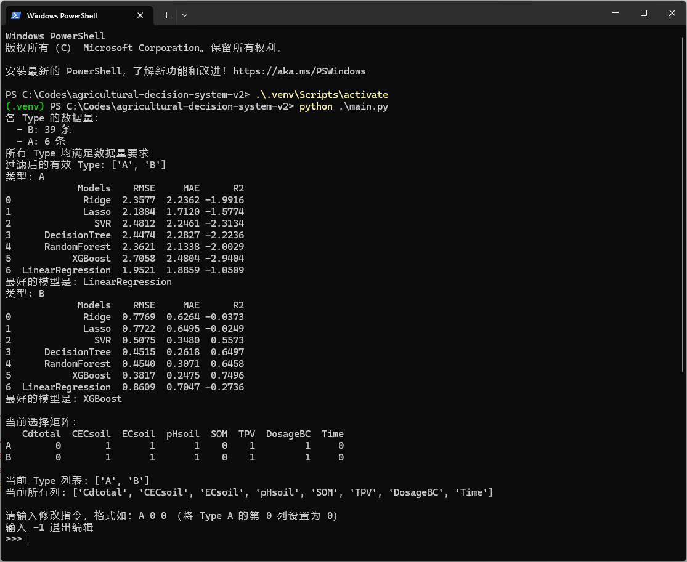
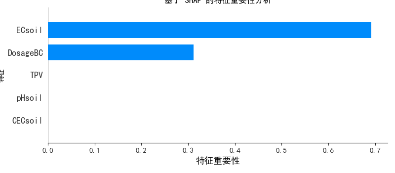
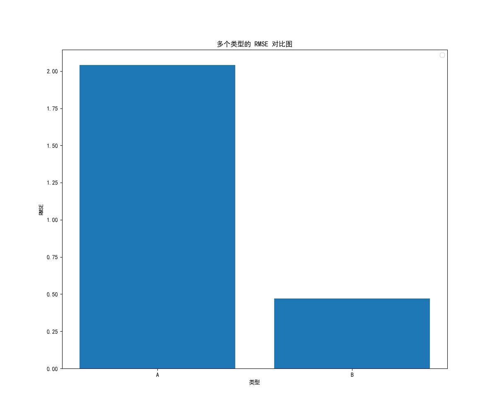
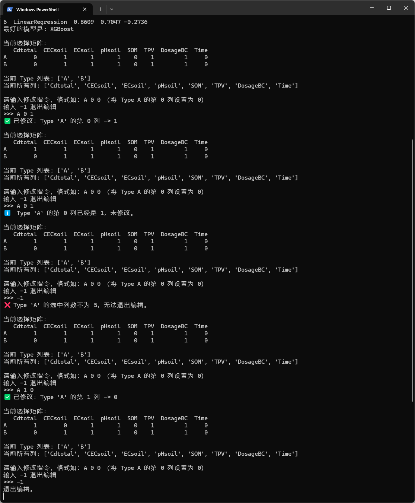
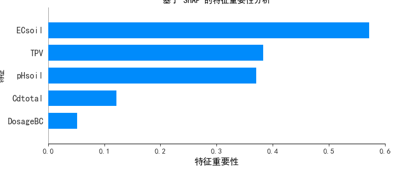
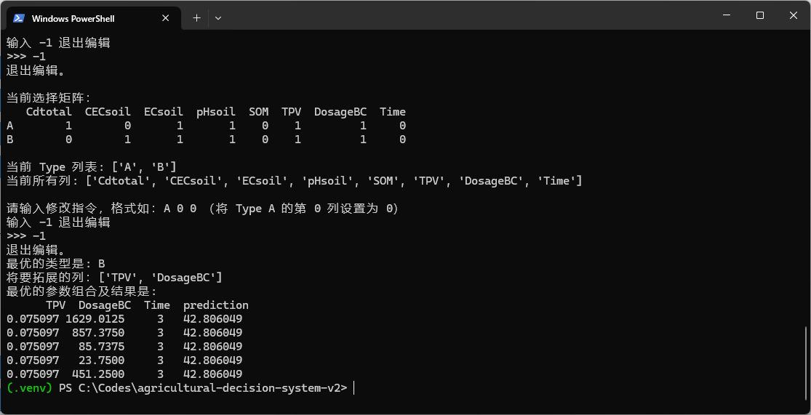

# 说明文档

## 环境要求

- Python 3.10+

## 虚拟环境配置

### 创建虚拟环境
```bash
python -m venv ,venv
```

### 激活虚拟环境
```bash
# Windows 系统
.venv\Scripts\activate

# Linux/Mac 系统
source .venv/bin/activate
```

### 安装依赖包
```bash
pip install -r requirements.txt
```

### 运行项目代码

```bash
python main.py
```

## 项目参数配置

项目参数配置位于 `configs/custom.yaml` 和 `configs/default.yaml` 其中 `default.yaml` 包含所有参数配置，而 `custom.yaml` 会覆盖其配置。

参数说明如下

```yaml
init_data: [0.5, 0.5, 0.5, 0.5, 0.5]	# 初始向量
filter_threshold: 0.6	# 余弦过滤阈值
datasets:
  path: "data/决策算法测试数据.xlsx"	# 数据文件相对路径
  sence_columns: ["Cdtotal", "CECsoil", "ECsoil", "pHsoil", "SOM"]	# 场景列列名
  process_columns: ["TPV", "DosageBC", "Time"]	# 工艺列列名
  type_columns: ["Type"]	# 类型列列名
  result_columns: ["Cdreduction rate"]	# 结果列列名
train:
  test_size: 0.2	# 验证集比例
  random_state: 42	# 随机数参数

search_params_threshold: 10	# 参数搜索阈值
search_params_num_iter: 4	# 参数搜索迭代次数
select_variables_threshold: 0.5	# 变量选择阈值
select_variables_max_num: 5		# 变量选择最大数目

```

## 程序运行

### 初始运行

#### 控制台运行输出



#### Type A 的 shap 值输出



#### Type A & B 的 RMSE 对比



### 模型特征选择人工介入

#### 控制台控制演示



#### 修改后的 Type A 的 shap 值初始 shap 值对比

##### 修改后



##### 修改前


### 模型最终结果输出

#### 控制台在未继续修改的情况下退出编辑进入最终结果输出

